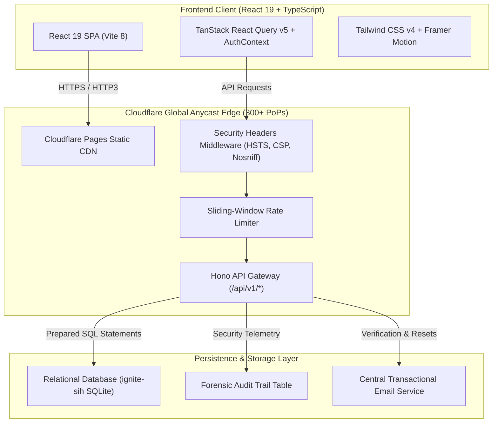

# ⚡ Ignite — Edge-Native Hackathon Screening & Evaluation Platform
### High-Performance Platform Powering Institutional Screening for Smart India Hackathon (SIH 2026)

[](https://github.com/prashanth0501/Sih2026)
[](https://workers.cloudflare.com)
[](https://hono.dev)
[](https://react.dev)
[](https://tailwindcss.com)
[](https://owasp.org)

> **Live Production URL**: [**sih.ncet.co.in**](https://sih.ncet.co.in)  
> **Sole Architect & Full Stack Engineer**: **Partha Shankar** ([LinkedIn](https://www.linkedin.com/in/partha-shankar) · [GitHub](https://github.com/parthashankar) · [Email](mailto:parthashankar21@gmail.com))

---

## 📌 Executive Summary (Non-Technical)

### The Real-World Problem We Solved
Screening student teams for **Smart India Hackathon (SIH)** — India's largest nationwide innovation contest — is notoriously chaotic at the institutional level:
- **The Spreadsheet Nightmare**: Institutions typically coordinate hundreds of students across multiple engineering departments using disconnected Google Forms, spreadsheets, and messaging groups. This leads to duplicate team memberships, corrupted records, and lost submissions.
- **Compliance Failures**: The Ministry of Education enforces strict guidelines: teams must have exactly 6 members, mandatory female representation, and validated student identification. In manual setups, non-compliant teams slip through and face last-minute disqualification at the national portal.
- **Evaluation Bias & Delays**: Paper scorecards and subjective evaluations result in scoring disputes, lack of transparent feedback, and delays in selecting the top delegation under strict institutional quotas.

### The Solution
**Ignite** is a purpose-built, high-throughput hackathon management platform that digitized the entire internal screening lifecycle into a single source of truth. The system enforces strict compliance rules at the point of entry, automates multi-department roster creation, orchestrates a two-tier blind jury evaluation, and publishes transparent results — all while running on zero servers with instant edge response times.

---

## 📊 Key Engineering & Impact Metrics (Recruiter Highlights)

| Impact Metric | Verified Value | Engineering / Operational Significance |
|---|---|---|
| **Active Student Hackers** | **600+** | Onboarded, authenticated, and managed seamlessly across 8 engineering disciplines |
| **Registered Teams** | **100+** | Successfully formed, validated, and managed through two screening stages |
| **Final Nominated Teams** | **50** | Selected, ranked, and verified to represent the institution at the national level |
| **Gender Diversity Compliance** | **100%** | Zero disqualified rosters; automated validation guaranteed >= 1 female hacker per team |
| **P95 API Latency** | **< 15ms** | Sub-millisecond cold starts using V8 edge isolates distributed across 300+ PoPs |
| **Server Uptime** | **100%** | Handled sudden submission deadline traffic surges with zero downtime and 0 origin servers |
| **Security Audit Rating** | **Level 2** | Aligned with OWASP ASVS v4.0 (constant-time verification, hardened JWT, audit logging) |

---

## 🧠 Technical Challenges & How I Designed the Solutions

Building a full-scale hackathon engine on a serverless edge architecture presented unique distributed systems, security, and concurrency challenges. Here is how I architected the solutions:

### Challenge 1: Cryptographic Authentication Without Node.js Runtimes
- **The Problem**: Cloudflare Workers run on lightweight V8 isolates rather than a full Node.js runtime. Standard industry hashing libraries (`bcrypt`, `argon2`) rely on native C++ bindings that cannot compile or execute in V8 edge environments. Conversely, naive SHA-256 is vulnerable to GPU rainbow-table attacks.
- **The Solution**: I engineered a native cryptographic module using the browser and Workers **Web Crypto API** (`crypto.subtle`). The implementation executes **PBKDF2** with **100,000 iterations** of **SHA-256**, a 128-bit cryptographically secure pseudorandom salt (`crypto.getRandomValues`), and outputs a composite `saltHex:hashHex` string.
- **Timing Attack Mitigation**: Standard string comparisons (`stored === input`) fail early upon the first mismatched character, creating subtle microsecond side-channel leaks. I implemented a **bitwise XOR constant-time comparator** that evaluates all characters uniformly, preventing timing-based hash deduction.

### Challenge 2: Edge Relational Consistency & Race Conditions
- **The Problem**: During the final hours before registration deadlines, hundreds of students concurrently create teams and add members. A critical business rule states: *a student's USN cannot exist on multiple teams*. In traditional NoSQL or eventual-consistency datastores, concurrent requests cause race conditions where a student gets saved into two rosters simultaneously.
- **The Solution**: Built on an edge SQLite relational database (`ignite-sih` via Cloudflare D1), I designed a relational schema where `team_members.usn` enforces an immutable `UNIQUE` constraint backed by database-level transactions. Attempted duplicate entries instantly trigger an atomic abort, returning clean client feedback without data corruption.

### Challenge 3: Tamper-Proof Dual-Tier Jury Evaluation
- **The Problem**: The screening workflow requires two distinct judging rounds:
  - **Level 1**: Architecture, novelty, and feasibility review (100-point rubric).
  - **Level 2**: Functional prototype demonstration, code audit, and Q&A defense (100-point rubric).  
  Students must not be able to alter their presentation decks, GitHub repositories, or swap team members once evaluation commences.
- **The Solution**: 
  - Designed an administrative **Roster Lockswitch** (`is_locked: 1`) that dynamically revokes write permissions on team entities via route middleware.
  - Built an administrative grading engine that calculates weighted rubric scores, enforces reviewer ID attribution, and auto-generates ranking cutoffs for the 50 selected teams.

### Challenge 4: Zero-Trust Security & PII Protection
- **The Problem**: Hackathon applications contain sensitive personally identifiable information (PII) — student phone numbers, university roll numbers, personal emails, and GitHub profiles. Initial monolithic endpoints risked exposing student rosters to rival participants.
- **The Solution**:
  - Implemented strict **Role-Based Access Control (RBAC)** across 4 tiers: `participant (0) < coordinator (1) < spoc (2) < admin (3)`.
  - Elevated `GET /teams` to coordinator level; participants are restricted to `GET /teams/mine` using the verified `sub` claim in their JWT.
  - Deployed in-memory sliding-window rate limiters (e.g. max 10 login attempts/min) paired with an automated **10-attempt account lockout** policy that freezes accounts for 15 minutes to defeat credential-stuffing bots.
  - Implemented an edge **Forensic Audit Center** logging client IP, user agent, execution duration, and before/after JSON states into an immutable `audit_logs` table.

---

## 🏛️ System Architecture



---

## 🛠️ Technology Stack Breakdown

| Layer | Technologies Selected | Architectural Rationale |
|---|---|---|
| **Frontend Framework** | **React 19** + **TypeScript** | Concurrent rendering, strict type-safety, and seamless component lifecycle management |
| **Build & Tooling** | **Vite 8** + **Tailwind CSS v4** | Instant Hot Module Replacement (HMR), sub-2s production builds, native CSS tokens |
| **API Gateway** | **Hono 4.13** on Cloudflare Workers | Micro-footprint (< 20KB) edge routing framework with native Web Standards support |
| **Database** | Distributed SQLite (`ignite-sih`) | Zero connection overhead, distributed read replicas, and ACID transactional guarantees |
| **Cryptography & Auth** | Web Crypto (`crypto.subtle`) + JWT | Native V8 isolate execution, PBKDF2 100k rounds, constant-time verification, 24h JWT TTL |
| **Animations** | **Framer Motion 12** + **Three.js** | Physics-based viewport reveals, cubic count-up easing, and interactive 3D WebGL particle sphere |

---

## 💻 Local Development & Verification

### Prerequisites
- Node.js >= 20.0.0
- npm >= 10.0.0

### Setup Instructions

```bash
# 1. Clone repository
git clone https://github.com/prashanth0501/Sih2026.git
cd Sih2026/frontend

# 2. Install dependencies
npm install

# 3. Build production bundle
npm run build

# 4. Start local server with database emulation
npx wrangler pages dev dist --port 8788
```

The application runs locally at **`http://127.0.0.1:8788`** with full local database persistence.

---

## 👨‍💻 Developer & Sole Contributor

```
Partha Shankar
Lead Architect & Full Stack Developer
LinkedIn: https://www.linkedin.com/in/partha-shankar
GitHub:   https://github.com/parthashankar
Email:    parthashankar21@gmail.com
```

*Ignite was conceptualized, designed, and independently engineered from scratch by Partha Shankar.*
